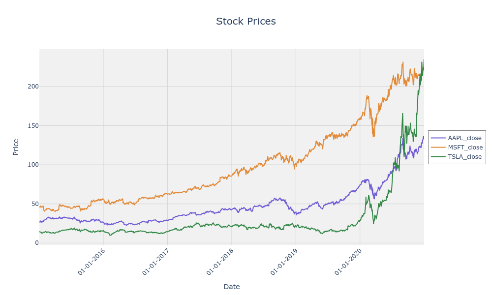
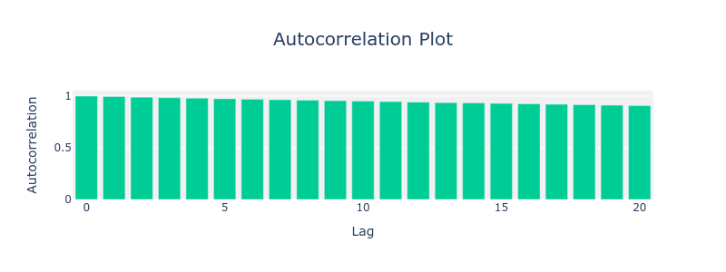
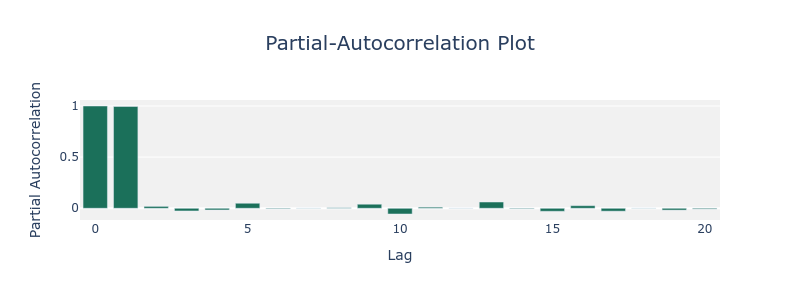
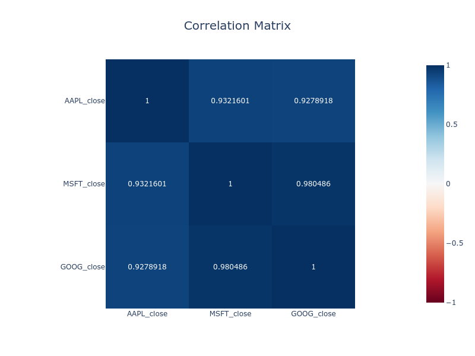
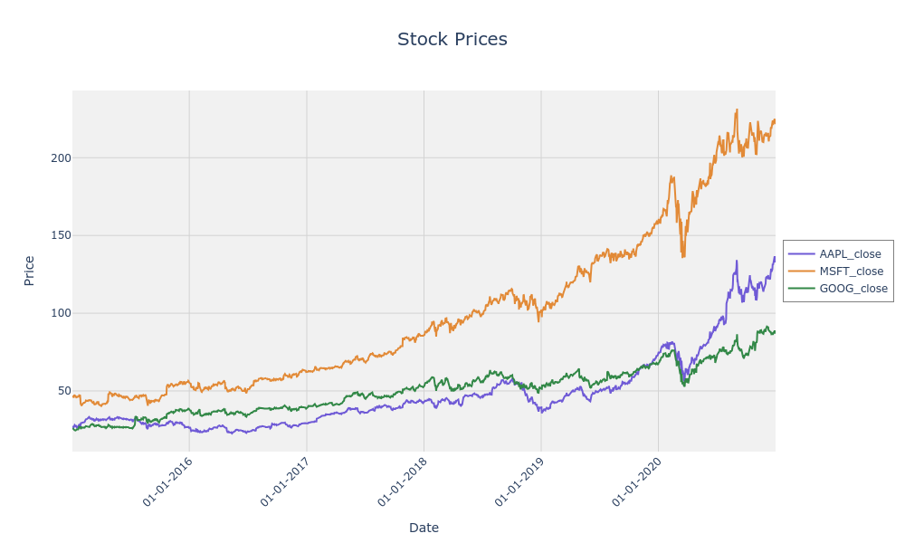
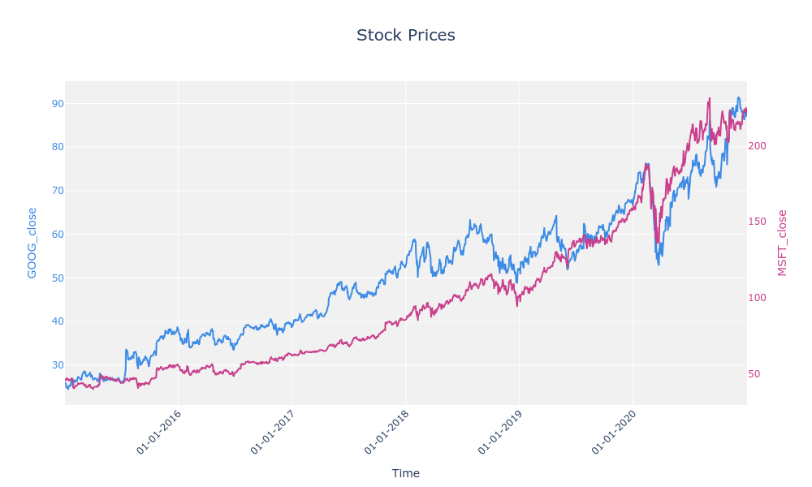

# Demo 

## PLUTUS Pair Identification

In this section, we demonstrate how to identify cointegrated pairs using the PLUTUS package.

```py title="plutus_pair_identification_demo.py" linenums="1"
import plutus_pairtrading.data_acquisitions as dacq
import plutus_pairtrading.data_generations as dgen
import plutus_pairtrading.data_visualizations as dviz

# Fetch stock data for multiple securities
AAPL_df = dacq.fetch_yahoo_finance_data("AAPL", start_date="2015-01-01", end_date="2021-01-01")
MSFT_df = dacq.fetch_yahoo_finance_data("MSFT", start_date="2015-01-01", end_date="2021-01-01")
GOOG_df = dacq.fetch_yahoo_finance_data("GOOG", start_date="2015-01-01", end_date="2021-01-01")
TSLA_df = dacq.fetch_yahoo_finance_data("TSLA", start_date="2015-01-01", end_date="2021-01-01")

# Combine the data into a single DataFrame
stock_df = dacq.combine_dataframes([AAPL_df, MSFT_df, GOOG_df, TSLA_df])

# Perform pair identification
pairs_df = dgen.pairs_identification(
    data=stock_df,
    stationarity_method="ADF",
    cointegration_method="phillips-ouliaris",
    stationarity_significance_level=0.05,
    coint_significance_level=0.05,
)

# Display the identified pairs
print(pairs_df)
```

## PLUTUS Tests

The PLUTUS toolkit includes comprehensive tests for stationarity, cointegration, and data validation to ensure the accuracy and reliability of pair-trading strategies.

### Stationarity Tests

#### Augmented Dickey-Fuller Test (ADF)

The ADF test checks for stationarity in a time-series.

=== "ADF Test"

    ```py 
    from plutus_pairtrading.tests.stationarity_tests import augmented_dickey_fuller_test
    import pandas as pd

    # Load sample data
    data = pd.read_csv("data/tickers/AAPL.csv", index_col="date", parse_dates=True)

    # Perform ADF Test
    result = augmented_dickey_fuller_test(
        data=data,
        security="close",
        trend="constant",
        significance_level=0.05,
    )

    print(result)
    ```


=== "Expected Output"

    ```json
    {
        "Statistic": -3.5,
        "p-Value": 0.01,
        "Stationary": True,
        "Lags": 5,
        "Trend": "constant",
        "Critical Values": {"1%": -3.43, "5%": -2.86, "10%": -2.57},
    }
    ```


#### Phillips-Perron Test (PP)

The PP test is another method for assessing stationarity.


from plutus_pairtrading.tests.stationarity_tests import philips_perron_test
import pandas as pd

# Load sample data
data = pd.read_csv("data/tickers/GOOG.csv", index_col="date", parse_dates=True)

# Perform PP Test
result = philips_perron_test(
    data=data,
    security="close",
    trend="constant",
    significance_level=0.05,
)

print(result)


## PLUTUS Data Acquisition 

This section highlights how to acquire data using the PLUTUS package:

You can fetch historical financial data for multiple tickers using the fetch_yahoo_finance_data function.

=== "Code"

    ```py title="data_acquisition_demo.py" linenums="1"

    import plutus_pairtrading.data_acquisitions as dacq

    # Fetch stock data for AAPL, MSFT, and TSLA
    AAPL_df = dacq.fetch_yahoo_finance_data(
        "AAPL", start_date="2015-01-01", end_date="2021-01-01",
    )
    MSFT_df = dacq.fetch_yahoo_finance_data(
        "MSFT", start_date="2015-01-01", end_date="2021-01-01"
    )
    TSLA_df = dacq.fetch_yahoo_finance_data(
        "TSLA", start_date="2015-01-01", end_date="2021-01-01"
    )

    # Combine the data into a single DataFrame
    stock_df = dacq.combine_dataframes([AAPL_df, MSFT_df, TSLA_df])

    # Save the data to CSV files
    dacq.store_data_as_csv(AAPL_df, "data/tickers/AAPL.csv", )
    dacq.store_data_as_csv(MSFT_df, "data/tickers/MSFT.csv")
    dacq.store_data_as_csv(TSLA_df, "data/tickers/TSLA.csv")

    combined_df = dacq.read_and_combine_ticker_files(
        directory_path="data/tickers",
        tickers=["AAPL", "MSFT", "TSLA"],
        date_column="date",
        column_suffix=["close", "close_adj"],
        join_type="inner",
    )
    ```

=== "Combined DataFrame"

    | date       | AAPL_close_adj | AAPL_close | MSFT_close_adj | MSFT_close | TSLA_close_adj | TSLA_close |
    |------------|----------------|------------|----------------|------------|----------------|------------|
    | 2015-01-02 | 24.347172      | 27.332500  | 40.232841      | 46.759998  | 14.620667      | 14.620667  |
    | 2015-01-05 | 23.661276      | 26.562500  | 39.862869      | 46.330002  | 14.006000      | 14.006000  |
    | 2015-01-06 | 23.663506      | 26.565001  | 39.277802      | 45.650002  | 14.085333      | 14.085333  |
    | 2015-01-07 | 23.995310      | 26.937500  | 39.776840      | 46.230000  | 14.063333      | 14.063333  |
    | 2015-01-08 | 24.917269      | 27.972500  | 40.946987      | 47.590000  | 14.041333      | 14.041333  |


=== "Time-Series Plot"

    { width=800 }


## PLUTUS Data Visualization

[PLUTUS] has `data_visualizations` module. Here’s how each plot for pair-trading looks like:


=== "ACF and PACF"

    { width=800 }

    { width=800 }

    Here is the code to plot autocorrelation and partial-autocorrelation functions for a security:
    

    ```py title="plutus_plot_acf_pacf_demo.py" linenums="1"

    import plutus_pairtrading.data_acquisitions as dacq
    import plutus_pairtrading.data_visualizations as dviz

    # Fetch stock data
    AAPL_df = dacq.fetch_yahoo_finance_data("AAPL", start_date="2015-01-01", end_date="2021-01-01")   

    # Plot autocorrelation plot
    acf_fig = dviz.plot_acf(AAPL_df, security="AAPL_close")
    
    # Plot partial-autocorrelation plot
    pacf_fig = dviz.plot_pacf(AAPL_df, security="AAPL_close")

    #acf_fig.show() 
    pacf_fig.show()
    ```
    
=== "Correlation Matrix"

    { width=800 }

    Here is the code to generate the correlation matrix plot: 
    

    ```py title="plutus_plot_correlation_matrix_demo.py" linenums="1"

    import plutus_pairtrading.data_acquisitions as dacq
    import plutus_pairtrading.data_visualizations as dviz

    # Fetch stock data
    AAPL_df = dacq.fetch_yahoo_finance_data("AAPL", start_date="2015-01-01", end_date="2021-01-01")   
    MSFT_df = dacq.fetch_yahoo_finance_data("MSFT", start_date="2015-01-01", end_date="2021-01-01")   
    GOOG_df = dacq.fetch_yahoo_finance_data("GOOG", start_date="2015-01-01", end_date="2021-01-01")

    stock_df = dacq.combine_dataframes([AAPL_df, MSFT_df, GOOG_df])

    # Plot correlation matrix
    fig = dviz.plot_correlation_matrix(
        data=stock_df,
        securities=["AAPL_close", "MSFT_close", "GOOG_close"],
    )

    fig.show() 
    ```

=== "Time-series Plot"

    { width=800 }

    Here is the code to generate the time-series plot: 

    ```py title="plutus_plot_timeseries_demo.py" linenums="1"

    import plutus_pairtrading.data_acquisitions as dacq
    import plutus_pairtrading.data_visualizations as dviz

    # Fetch stock data
    AAPL_df = dacq.fetch_yahoo_finance_data("AAPL", start_date="2015-01-01", end_date="2021-01-01")   
    MSFT_df = dacq.fetch_yahoo_finance_data("MSFT", start_date="2015-01-01", end_date="2021-01-01")   
    GOOG_df = dacq.fetch_yahoo_finance_data("GOOG", start_date="2015-01-01", end_date="2021-01-01")

    stock_df = dacq.combine_dataframes([AAPL_df, MSFT_df, GOOG_df])

    # Plot time-series
    fig = dviz.plot_timeseries(
        data=stock_df,
        securities=["AAPL_close", "MSFT_close", "GOOG_close"],
        plot_title="Stock Prices",
        x_label="Date",
        y_label="Price",
        line_colors=["#6F5AD6", "#E28A37", "#328847"],
    )

    fig.show()   
    ```


=== "Dual Y-Axis Plot"

    { width=800 }

    Here is the code to generate the dual y-axis time-series plot: 
    

    ```py title="plutus_plot_dual_timeseries_demo.py" linenums="1"

    import plutus_pairtrading.data_acquisitions as dacq
    import plutus_pairtrading.data_visualizations as dviz

    # Fetch stock data
    MSFT_df = dacq.fetch_yahoo_finance_data("MSFT", start_date="2015-01-01", end_date="2021-01-01")   
    GOOG_df = dacq.fetch_yahoo_finance_data("GOOG", start_date="2015-01-01", end_date="2021-01-01")

    stock_df = dacq.combine_dataframes([MSFT_df, GOOG_df])

    # Plot dual y-axis time-series
    fig = dviz.plot_dual_timeseries(
        data=stock_df,
        securities=["GOOG_close", "MSFT_close"],
        plot_title="Stock Prices",
        line_colors=["#3C8BE5", "#C93F8C"],
    )

    fig.show() 
    ```

Thank you for exploring our demo! We hope this example has given you a brief understanding of how to utilize our package and integrate its features into your projects. Whether you're just getting started or diving deeper, our goal is to make your experience as seamless and productive as possible.

Happy coding!

  [PLUTUS]: https://pypi.org/project/plutus-pairtrading/
  [virtual environment]: https://realpython.com/what-is-pip/#using-pip-in-a-python-virtual-environment